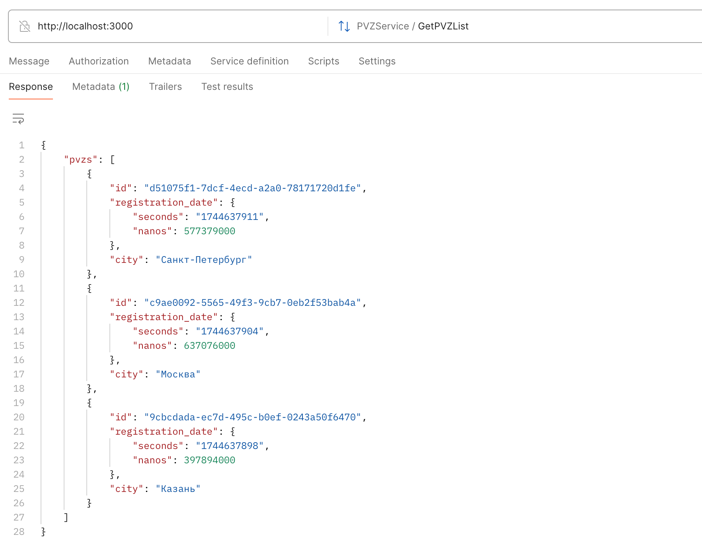

# PVZ Service

## Введение

Этот сервис отвечает за учет пунктов выдачи заказов (ПВЗ), приёмки и обработку товаров в рамках этих приёмок.

Проект собран с учётом принципов чистой архитектуры.

### Основные возможности:

- **Аутентификация JWT-токен**
- **Создание ПВЗ**
- **Создание приемки товаров**
- **Добавление товаров в рамках приемки**
- **Удаление товаров в рамках приемки по принципу LIFO**
- **Закрытие приемки**
- **Получение данных о ПВЗ и всей информации по ним**

### Используемые технологии

- **Язык:** Go 1.24
- **База данных:** PostgreSQL
- **Фреймворки/библиотеки:**
    - [gin-gonic](https://github.com/gin-gonic/gin) – роутер и обработка запросов
    - [viper](https://github.com/spf13/viper) – конфигурация
    - [sqlx](https://github.com/jmoiron/sqlx) – работа с БД
    - [go-transaction-manager](https://github.com/avito-tech/go-transaction-manager) - работа с транзакциями
    - [jwt-go](https://github.com/golang-jwt/jwt) - авторизация
    - [logrus](https://github.com/sirupsen/logrus) – логирование
    - [swaggo/swag](https://github.com/swaggo/swag) - генерация документации
    - [prometheus](https://github.com/prometheus/client_golang) - сбор метрик
- **Тестирование:**
    - [testify](https://github.com/stretchr/testify), [gomock](https://github.com/golang/mock), [sqlmock](https://github.com/DATA-DOG/go-sqlmock) — unit tests
    - [testcontainers-go](https://github.com/testcontainers/testcontainers-go), [golang-migrate](https://github.com/golang-migrate/migrate) — integration test
- **Контейнеризация:** Docker Compose

---

## Начало работы

### Установка

1. **Клонировать репозиторий:**

    ```sh
    git clone https://github.com/senyabanana/pvz-service.git
    cd pvz-service
    ```

2. **Создать и заполнить файл `.env` на основе `.env.example`**

3. **Запустить сервис через Docker Compose:**
    ```sh
    docker-compose up --build -d
    ```

### Использование

| **Команда**                        | **Описание**                 |
|------------------------------------| ---------------------------- |
| `docker-compose up --build -d`     | Запустить сервис             |
| `docker-compose down`              | Остановить сервис            |
| `docker-compose down -v`           | Остановить и очистить volume |

### Тестирование

1. **Unit-тестирование:**

    ```sh
   go test -v ./internal/... --cover
   ```
   Для дополнительной информации о покрытии, выполните:

   ```sh
   go test -coverprofile=coverage.out ./internal/... && go tool cover -html=coverage.out
   ```

2. **Интеграционное тестирование:**

   Должен быть запущен Docker.

   Тест не требует запущенного сервиса. Он создает и поднимает контейнер PostgreSQL, применяет миграции и проводит тест-цепочку:
    - создает ПВЗ
    - создает приёмку
    - добавляет 50 товаров
    - закрывает приёмку

    ```sh
    go test -v -tags=integration ./tests/integration
    ```

## Линтинг кода

Проект использует `golangci-lint` для анализа кода, предотвращения ошибок и обеспечения единообразия кодовой базы.

### Конфигурация `.golangci.yml`

#### **Линтеры:**

- **govet** – стандартный анализатор кода Go, выявляющий потенциальные ошибки.
- **staticcheck** – расширенный анализатор, находящий устаревший код и потенциальные ошибки.
- **errcheck** – проверяет, что все ошибки обработаны корректно.
- **gosimple** – упрощает код, предлагая более идиоматичные конструкции.
- **ineffassign** – обнаруживает переменные, которым присвоены, но не использованные значения.
- **unused** – проверяет неиспользуемые переменные, константы и типы.
- **gofmt** – автоматически форматирует код в соответствии со стандартами Go.
- **revive** – гибкая замена `golint`, позволяющая настраивать правила проверки кода.
- **gci** – проверяет порядок импортов и автоматически группирует их.
- **bodyclose** – проверяет закрытие тел HTTP-запросов.
- **dogsled** – проверяет пропущенные идентификаторы в множественных присваиваниях.

#### **Настройки линтеров:**

- `gci` – определяет порядок импортов (стандартные, сторонние, локальные).
- `revive` – содержит правила именования переменных, комментариев к пакетам и предупреждения о проблемах в коде.

#### **Запуск линтера:**

   ```sh
     golangci-lint run
   ```

## Swagger-документация

Документация эндпоинтов доступна после запуска сервиса: [http://localhost:8080/swagger/index.html](http://localhost:8080/swagger/index.html)

## Сбор метрик

Для сбора метрик используется `Prometheus`. Метрики доступны после запуска сервиса: [http://localhost:9000/metrics](http://localhost:9000/metrics)

Собираются следующие типы метрик:

Технические:
* Количество запросов
* Время ответа

Бизнесовые:
* Количество созданных ПВЗ
* Количество созданных приёмок заказов
* Количество добавленных товаров

## REST API эндпоинты

### **Аутентификация**

#### `POST /dummyLogin`

- **Описание:** Получение JWT без регистрации (по роли).
- **Тело запроса:**
  ```json
  {
    "role": "client"
  }
  ```
- **Ответ:**
  ```json
  {
    "token": "jwt-token"
  }
  ```
- **Ошибки:**
    - `400 Bad Request` – Неверный формат или неизвестная роль
    - `500 Internal Server Error` – Ошибка генерации токена


#### `POST /register`

- **Описание:** Регистрация нового пользователя.
- **Тело запроса:**
  ```json
  {
    "email": "user@example.com",
    "password": "secret123",
    "role": "moderator"
  }
  ```
- **Тело ответа (успех 201 Created):**
  ```json
  {
    "id": "uuid",
    "email": "user@example.com",
    "role": "moderator"
  }
  ```
- **Ошибки:**
    - `400 Bad Request` – Неверный формат email/роли, email уже используется
    - `500 Internal Server Error` – Ошибка сервера

#### `POST /login`

- **Описание:** Авторизация пользователя.
- **Тело запроса:**
  ```json
  {
    "email": "user@example.com",
    "password": "secret123"
  }
  ```
- **Тело ответа (успех 200 OK):**
  ```json
  {
    "token": "jwt-token"
  }
  ```
- **Ошибки:**
    - `400 Bad Request` – Неверный формат данных
    - `401 Unauthorized` – Неверный email или пароль
    - `500 Internal Server Error` – Ошибка сервера

---

### **Работа с ПВЗ**

#### `POST /pvz`

- **Описание:** Создание нового ПВЗ.
- **Тело запроса:**
  ```json
  {
    "city": "Москва"
  }
  ```
- **Ответ (201 Created):**
  ```json
  {
    "id": "uuid",
    "registrationDate": "2025-04-14T10:00:00Z",
    "city": "Москва"
  }
  ```
- **Ошибки:**
    - `400 Bad Request` – Неподдерживаемый город
    - `500 Internal Server Error` – Ошибка создания

#### `GET /pvz`

- **Описание:** Получение списка ПВЗ с приёмками и товарами.
- **Параметры запроса (необязательно):** `startDate`, `endDate`, `page`, `limit`
- **Ответ:**
  ```json
  [
    {
      "pvz": {
        "id": "uuid",
        "registrationDate": "...",
        "city": "Казань"
      },
      "receptions": [
        {
          "reception": {
            "id": "uuid",
            "dateTime": "...",
            "pvzId": "uuid",
            "status": "in_progress"
          },
          "products": [
            {
              "id": "uuid",
              "dateTime": "...",
              "type": "электроника",
              "receptionId": "uuid"
            }
          ]
        }
      ]
    }
  ]
  ```
- **Ошибки:**
    - `400 Bad Request` – Неверный формат даты
    - `500 Internal Server Error` – Ошибка получения данных

---

### **Работа с приёмками**

#### `POST /receptions`

- **Описание:** Создание новой приёмки для ПВЗ.
- **Тело запроса:**
  ```json
  {
    "pvzId": "uuid"
  }
  ```
- **Ответ:**
  ```json
  {
    "id": "uuid",
    "dateTime": "...",
    "pvzId": "uuid",
    "status": "in_progress"
  }
  ```
- **Ошибки:**
    - `400 Bad Request` – Некорректный UUID или приёмка уже существует
    - `404 Not Found` – ПВЗ не найден
    - `500 Internal Server Error` – Ошибка создания

#### `POST /pvz/{pvzId}/close_last_reception`

- **Описание:** Закрытие последней открытой приёмки.
- **Ответ:**
  ```json
  {
    "id": "uuid",
    "dateTime": "...",
    "pvzId": "uuid",
    "status": "close"
  }
  ```
- **Ошибки:**
    - `400 Bad Request` – Нет открытой приёмки или уже закрыта
    - `500 Internal Server Error` – Ошибка закрытия

---

### **Работа с товарами**

#### `POST /products`

- **Описание:** Добавление товара в текущую приёмку ПВЗ.
- **Тело запроса:**
  ```json
  {
    "pvzId": "uuid",
    "type": "обувь"
  }
  ```
- **Ответ:**
  ```json
  {
    "id": "uuid",
    "dateTime": "...",
    "type": "обувь",
    "receptionId": "uuid"
  }
  ```
- **Ошибки:**
    - `400 Bad Request` – Некорректный тип или нет активной приёмки
    - `500 Internal Server Error` – Ошибка добавления

#### `POST /pvz/{pvzId}/delete_last_product`

- **Описание:** Удаление последнего товара из текущей приёмки.
- **Ответ:** `200 OK`
- **Ошибки:**
    - `400 Bad Request` – Нет приёмки или нечего удалять
    - `500 Internal Server Error` – Ошибка удаления

---

### gRPC

#### Метод: `GetPVZList`

- **Описание:** Получение всех ПВЗ (без приёмок и товаров).

- **Пример использования через Postman:**
  
